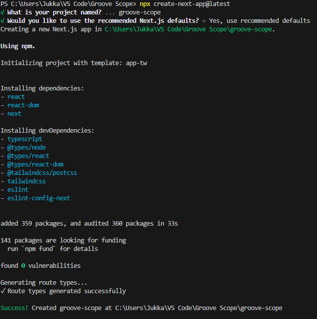
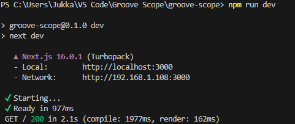
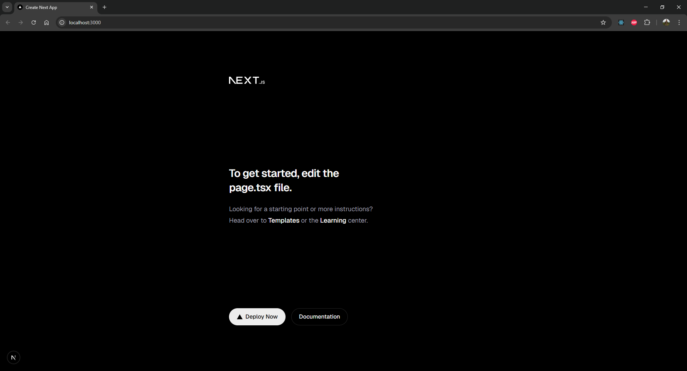
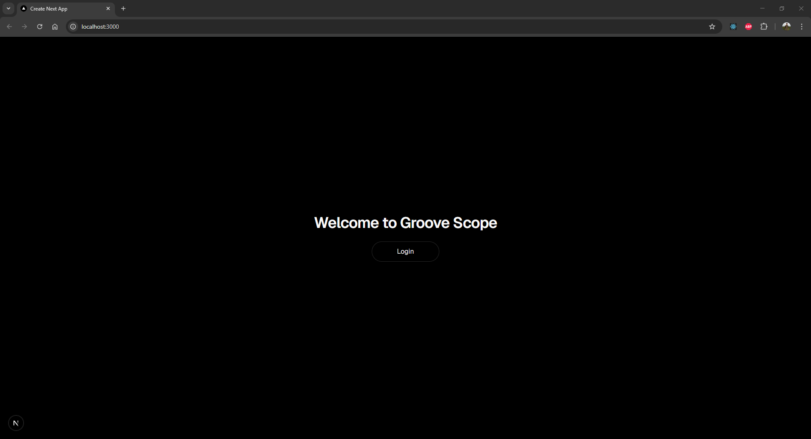

# Projektipäiväkirja - 12.11.2025
## Next.js asentaminen ja ensimmmäiset muutokset ohjelmistoon
Ensimmäisen päivän tavoitteeksi otin sovellusympäristön pystyttämisen ja perusrakenteen luomisen projektille. Lähdin liikkeelle Next.js:n asennuksesta, jotta FrontEndin puolella olisi jokin runko, johon dataa voisi alkaa visualisoimaan. Viralliselta verkkosivulta löytämäni dokumentaatio antoi selkeät ohjeet asennukseen.   
Asennus lähti liikkeelle komennolla `npx create-next-app@latest` 
Annoin projektille nimen "groove-scope" ja valitsin suositellut asetukset. Asennusprosessi sujui ongelmitta, ja sain nopeasti luotua perus Next.js -sovelluksen:  
  
Seuraavaksi siirryin luomaani groove-scope projektiin ja käynnistin kehityspalvelimen `npm run dev` komennolla:  
  
Asennuksen suorituksen jälkeen avasin selaimen ja navigoin osoitteeseen `http://localhost:3000`, jossa näin Next.js:n oletussivun. Tämä vahvisti, että asennus oli onnistunut ja kehitysympäristö oli toiminnassa:  
  
Luotuani perus Next.js-sovelluksen aloin tehdä projektiin ensimmäisiä muokkauksia, jotta voisin myöhemmin lisätä sovellukseen Go:lla rakennettavan backendin. Muokattava etusivu löytyi `app/page.tsx` tiedostosta, joka on koko Next.js-ohjelmiston aloitussivuna toimiva sivu ja tämä sivu näkyykin localhostiin mentäessä. Päätin tehdä yksinkertaisia muutoksia poistamalla kaikki ylimääräiset elementit sivulta ja lisäämällä hieman omaa tekstiä sekä yksittäisen buttonin sivulle, jotta ohjelmistoon voidaan kirjautua myöhemmin:   
  
Sivun tyhjennyksessä meni yllättävän kauan aikaa, sillä kaikki Tailwindin css-attribuutit eivät olleet minulle ennestään tuttuja. Tässä on hyvä aloitussivun pohja, johon voin alkaa lisätä backendin toiminnallisuuksia.
## Yhteenveto ja jatkotoimenpiteet
Tämän päivän aikana sain onnistuneesti asennettua Next.js-kehitysympäristön ja luotua perus sovelluksen. Lisäksi tein ensimmäiset muokkaukset etusivuun, mikä antaa hyvän pohjan jatkokehitykselle. Seuraavaksi aion keskittyä backendin rakentamiseen Go:lla ja integroimaan sen Next.js-frontendin kanssa.